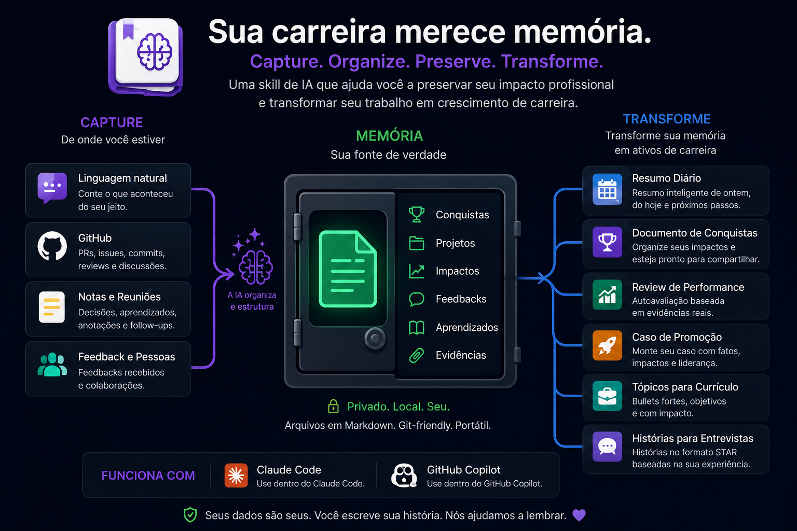

# Career Memory

**Nunca esqueça o trabalho que você fez.**

<p align="center">
  
</p>

Career Memory é uma agent skill que mantém um registro persistente e factual do
seu trabalho profissional — e transforma esse mesmo registro no que você
precisar escrever depois: uma daily, um brag document, uma avaliação de
desempenho, um caso de promoção, bullets de currículo, histórias de entrevista.

Você menciona o que fez, com suas próprias palavras, enquanto já está
trabalhando:

> "Finalmente corrigi aquela race condition no pagamento. A PR é a #1234."

Isso vira uma evidência durável:

```markdown
---
id: 2026-08-20-corrigida-race-condition-no-fluxo-pagamento
date: 2026-08-20
type: problem-solving
project: pagamentos
status: confirmed
tags: [debugging, confiabilidade]
evidence:
  - type: github_pr
    reference: "#1234"
---

# Corrigida a race condition no fluxo de pagamento

Identifiquei e corrigi uma race condition no processamento de pagamentos.

## Impact

Not documented.
```

Seis meses depois, essa entrada escreve parte da sua avaliação. Você registrou
uma única vez.

```text
Trabalho → Evidência → Memória → Narrativa
```

## Por quê

Seu trabalho fica espalhado por PRs, threads de Slack, tickets, reuniões e
memória. Na época da avaliação, a maior parte já se perdeu. A solução de sempre
— "mantenha um brag document" — falha porque exige que você pare e escreva, e
ninguém faz isso de forma consistente.

Career Memory captura durante a conversa que você já está tendo com seu agente
de código, e devolve isso quando você precisa.

## A regra que torna o registro utilizável

**Ele nunca inventa nada.** Nenhuma métrica que você não disse, nenhum resultado
que você não relatou, nenhum feedback que você não recebeu. Quando algo é
desconhecido, o registro diz `Impact: not documented` em vez de chutar.

Essa restrição é o produto. Um registro de carreira que infla é um registro que
você não consegue defender numa conversa de avaliação — por isso este não infla.

## Instalação

### Claude Code (recomendado)

```bash
/plugin marketplace add emerlopes/career-memory
```

```bash
/plugin install career-memory@emerlopes-plugins
```

### Qualquer agente que leia `SKILL.md`

Copie o diretório da skill para onde seu agente procura skills:

```bash
git clone https://github.com/emerlopes/career-memory.git
cp -r career-memory/skills/career-memory ~/.claude/skills/career-memory
```

A skill é Markdown puro mais um único script Python sem dependências — nada
aqui é específico do Claude, exceto o caminho de instalação.

## Primeiro uso

```text
/career-memory:career-init
```

Isso cria seu store (por padrão em `~/career-memory`) e ajuda a preencher um
perfil curto. Depois é só trabalhar — e mencionar o que você fez.

Se preferir ler antes de usar, o [manual de uso](docs/MANUAL.md) cobre todas as
funcionalidades, uma a uma.

Você pode fixar o local onde preferir:

```bash
export CAREER_MEMORY_HOME="$HOME/Documents/career-memory"
```

## Configurações

As preferências ficam em `config.json`, dentro do próprio store — versionáveis,
legíveis e persistentes entre sessões:

```bash
python3 $CM config                      # mostra os valores atuais e as opções
python3 $CM config --set language=pt
```

| Configuração         | Padrão      | O que faz                                                                                                                        |
| -------------------- | ----------- | -------------------------------------------------------------------------------------------------------------------------------- |
| `language`           | `auto`      | Idioma das respostas e do corpo das entradas. `auto` segue o idioma da sua mensagem; `pt` ou `en` fixam.                         |
| `documents_language` | `same`      | Idioma dos documentos gerados. `same` segue o `language`; `pt`/`en` fixam; `ask` pergunta a cada documento.                      |
| `profile_gate`       | `documents` | O que um `profile.md` incompleto bloqueia: `documents` (brag, review, promoção, CV), `all` (tudo) ou `remind` (nada, só lembra). |

O idioma nunca afeta o schema — `type`, `status`, tipos de evidência e as chaves
do front matter continuam iguais, então o store funciona igual em qualquer
idioma.

Sobre o `profile_gate`: documentos gerados sem saber seu cargo e seu alvo saem
genéricos, porque são. Já a captura não depende disso — e evidência mencionada
de passagem se perde se a skill parar para perguntar seu cargo. Por isso o padrão
protege os documentos e deixa a captura livre.

## Toda interação começa pelo mesmo lugar

```bash
python3 $CM status
```

`status` cria o que faltar (diretórios, `profile.md`, `README.md`, `config.json`),
informa as configurações e diz se o perfil está completo:

```text
store: /Users/voce/career-memory
settings: language=auto, documents_language=same, profile_gate=documents
profile: incomplete — missing Role, Focus, Current Goals
blocked: documents
```

É idempotente, então a skill roda isso no início de qualquer interação: não
existe estado "não inicializado" para tratar, nem motivo para pedir permissão
para criar a estrutura.

## Como usar

Na maior parte do tempo você não precisa invocar nada. Diga o que aconteceu e
será capturado:

> "Subi o dashboard novo hoje, o cliente já está usando."
>
> "Passei a manhã ajudando o João a debugar o fluxo de autenticação."
>
> "Meu gestor disse que a reunião de planejamento foi boa porque eu conduzi."

Depois, peça o que precisar:

| Você pede                                      | Você recebe                                                               |
| ---------------------------------------------- | ------------------------------------------------------------------------- |
| "prepara minha daily"                          | Uma daily de 30–90 segundos, dividida em Ontem / Hoje / Impedimentos      |
| "o que eu fiz esse trimestre?"                 | Suas entradas reais, com datas e evidências                               |
| "gera meu brag document"                       | Destaques agrupados por tema, com evidências e o que não está documentado |
| "monta minha avaliação de desempenho"          | Avaliação estruturada, com cada afirmação rastreável                      |
| "que evidências eu tenho para Staff Engineer?" | Pontos fortes, padrões e as lacunas específicas                           |
| "transforma isso em bullets de currículo"      | Bullets de uma linha, só com números reais                                |
| "me prepara para entrevista comportamental"    | Histórias STAR construídas a partir de eventos reais                      |
| "fecha minha semana"                           | Resumo semanal do que foi registrado, com o que ficou sem evidência       |
| "o que está faltando na minha memória?"        | As lacunas concretas: sem evidência, sem impacto, candidatos parados      |
| "como minhas competências evoluíram?"          | Cada competência período a período, com a trajetória no registro          |
| "o que falta no meu registro para Staff?"      | Cobertura por critério do nível, e o que o registro ainda não menciona    |

Há slash commands para as mesmas coisas: `/career-memory:career-daily`,
`career-add`, `career-brag`, `career-review`, `career-promotion`,
`career-resume`, `career-interview`, `career-search`, `career-github`,
`career-weekly`, `career-monthly`, `career-checkup`, `career-gaps`,
`career-trends`.

Há um **[manual de uso](docs/MANUAL.md)** com cada funcionalidade em detalhe: o
que ela faz, como pedir em linguagem natural, o slash command correspondente, o
comando de CLI por baixo e as armadilhas de cada uma.

## GitHub

Seu trabalho já está registrado em algum lugar: PRs, issues, reviews e commits.
Career Memory lê essa atividade (somente leitura) e transforma em evidência —
sempre como **candidata**, nunca como registro confirmado sem você dizer.

```text
/career-memory:career-github last-month
```

> "o que eu mergeei esse mês?" · "importa minhas PRs da semana" ·
> "linka a PR #1234 na entrada de ontem"

```bash
python3 $CM github check                       # verifica o acesso e a conta
python3 $CM github discover --window 7d        # mostra a atividade e o que já está registrado
python3 $CM github import --window 7d          # grava as novidades em candidates/
python3 $CM github link <id> <url-da-pr>       # anexa uma PR a uma entrada existente
```

Precisa da CLI do GitHub (`gh auth login`) ou de um `GITHUB_TOKEN` de leitura.
Nada é enviado para lugar nenhum: a descoberta só lê o GitHub e escreve nos seus
arquivos locais.

O que a descoberta faz e o que ela não faz:

- PRs, issues e reviews entram por padrão; commits só quando você pede
  (`--kinds commit`) — uma semana de commits não é uma semana de evidências.
- Uma PR mergeada vira uma entrada `delivery`; uma review vira `collaboration`;
  uma issue que você abriu vira `problem-solving`. São padrões mecânicos, para
  você corrigir antes de confirmar.
- Se a evidência já está registrada, ela é ignorada — reimportar é seguro.
- Se o sinal se parece com algo que você já contou, ele sugere **linkar** a PR na
  entrada existente em vez de duplicar.
- O título da PR é a evidência, não o impacto. `Impact: not documented` continua
  lá até você dizer o que aquilo mudou.

## Memória proativa

Registrar só funciona se continuar acontecendo — e normalmente para. Depois de
duas semanas ninguém lembra, e o trimestre inteiro some. Career Memory percebe
isso e diz uma frase útil, no momento em que ela é útil:

> Sua última captura foi há 11 dias, e a semana passada tem 4 entradas sem
> resumo. Quer que eu escreva?

```text
/career-memory:career-weekly last-week     # resumo semanal
/career-memory:career-monthly last-month   # resumo mensal
/career-memory:career-checkup              # o que está pendente
/career-memory:career-gaps                 # o que o registro ainda não prova
```

```bash
python3 $CM checkup                                        # panorama: pendências e lacunas
python3 $CM checkup --github                               # inclui atividade do GitHub fora do registro
python3 $CM summary --window last-week --format markdown   # os fatos da semana
python3 $CM gaps --window last-quarter                     # evidências faltantes
```

Os resumos vão para `outputs/summaries/2026-W33.md` e `outputs/summaries/2026-08.md`.
É por esse nome que o `checkup` sabe qual semana ou mês ainda não foi fechado.

As lacunas que ele encontra são de seis tipos: entrada **sem evidência**, **sem
impacto documentado**, impacto ainda marcado como inferido, **candidato parado**
esperando sua confirmação, **período sem nada registrado** e **competência do seu
`profile.md`** que nenhuma entrada menciona — essa última é a mais útil antes de
uma conversa de promoção.

Duas coisas que essa parte nunca faz:

- **Não preenche lacuna.** Cada lacuna vira uma pergunta para você ("aquele fix
  do retry parou os alertas?"), e a resposta é registrada como você deu. Sem
  resposta, `Impact: not documented` continua sendo o estado correto.
- **Não confunde o registro com a semana.** Duas entradas significam duas
  entradas _registradas_ — não que você fez duas coisas. Uma queda em relação ao
  mês passado é um fato sobre a captura, não sobre você.

E não vira lembrete chato: uma oferta por sessão, com número na frase, e se você
não quiser, o assunto morre ali.

## Inteligência de carreira

As mesmas entradas, lidas em trimestres em vez de dias. É a parte que responde
às perguntas longitudinais — como o trabalho evoluiu, o que se repete, e o que o
registro já sustenta para o nível que você quer:

```text
/career-memory:career-trends 12m           # como o registro evoluiu
/career-memory:career-promotion Staff Engineer
```

```bash
python3 $CM trends --window 12m                    # períodos, competências, padrões de impacto
python3 $CM trends --window 2y --format markdown   # o documento longitudinal
python3 $CM promotion --role "Staff Engineer"      # cobertura por critério, ao longo do tempo
python3 $CM graph --format mermaid                 # o que aparece junto nas entradas
```

**`trends`** divide o registro por mês, trimestre ou ano: entradas e cobertura
período a período, a trajetória de cada competência entre eles (`steady`, `new`,
`intermittent`, `paused`), os temas em que o impacto foi de fato documentado, e a
primeira metade do intervalo contra a segunda.

**`promotion`** mede o registro contra os critérios de um nível — vindos de
`--criterion`, de um `## Promotion criteria` no seu `profile.md`, ou, como último
recurso e dito com todas as letras, das suas competências. Cada critério cai em
um de três grupos: **registrado repetidamente**, **fino no registro** ou
**nenhuma entrada menciona**. Ele também lista o trabalho registrado que não
casa com critério nenhum — que costuma ser vocabulário diferente, não ausência.

Escreva a régua da sua empresa no `profile.md` e essa análise para de ser
genérica:

```markdown
## Promotion criteria — Staff Engineer

- Technical leadership: mentoring, migration, RFC
- Organisational impact: cross-team, roadmap
- System design: architecture, design doc
```

**`graph`** conecta projetos, competências, tags e pessoas que aparecem juntos
nas entradas — uma aresta é "N entradas mencionam os dois". Serve para achar os
agrupamentos em que seu trabalho realmente cai, e para ver a competência que só
aparece ao lado de um projeto (exatamente o que um comitê pergunta).

Duas coisas que essa parte nunca faz:

- **Não transforma sumiço em declínio.** "Nada registrado ultimamente sobre
  mentoria" significa que nada foi _registrado_. Você pode ter mentorado alguém
  toda semana e não contado para ninguém. A saída oferece recuperar o período,
  não narra uma queda.
- **Não dá veredito.** `promotion` diz como o registro cobre os critérios.
  Se você está pronto para o nível é julgamento sobre uma pessoa, feito por
  gente que conhece o contexto — não por uma ferramenta lendo arquivos Markdown.
  "Nenhuma entrada menciona estratégia organizacional" ajuda; "você não está
  pronto" não ajuda e pode estar simplesmente errado.

Um critério sem nada registrado é uma pergunta antes de ser uma lacuna: _isso
faltou no registro, ou faltou no ano?_ As duas coisas têm correções bem
diferentes, e só você sabe qual é.

## Seus dados

Markdown puro, num diretório que é seu:

```text
~/career-memory/
├── profile.md          seu cargo, foco e objetivos
├── config.json         idioma e comportamento da skill
├── entries/            evidências confirmadas, um arquivo por evento
├── candidates/         possíveis evidências aguardando sua confirmação (inclusive as do GitHub)
├── feedback/           feedbacks recebidos
├── projects/           contexto por projeto
└── outputs/            documentos gerados
    ├── summaries/      resumos semanais e mensais, um arquivo por período
    └── trends/         visões longitudinais de como o registro evoluiu
```

Local por padrão. Sem banco de dados, sem conta, sem servidor, nada é enviado
para lugar nenhum. Legível e editável sem nenhum agente. Coloque num repositório
git privado se quiser histórico:

```bash
cd ~/career-memory && git init && git add . && git commit -m "career memory"
```

## CLI

A skill usa uma CLI pequena para que ids, front matter e busca sejam exatos em
vez de improvisados. Você também pode usá-la diretamente:

```bash
CM=skills/career-memory/scripts/career_memory.py

python3 $CM status
python3 $CM config --set language=pt
python3 $CM init
python3 $CM add "Liderei a migração de 4 serviços" --type leadership --project plataforma
python3 $CM update 2026-08-20-liderei-migracao-4-servicos --add-evidence 'github_pr:#88'
python3 $CM list --window last-quarter
python3 $CM search "confiabilidade" --format full
python3 $CM stats --window 6m
python3 $CM summary --window last-week --format markdown
python3 $CM gaps --window last-quarter
python3 $CM checkup
python3 $CM trends --window 12m
python3 $CM promotion --role "Staff Engineer"
python3 $CM graph --format mermaid
python3 $CM validate

python3 $CM github discover --window last-month
python3 $CM github import --window last-month --dry-run
python3 $CM github link 2026-08-20-liderei-migracao-4-servicos acme/plataforma#88
```

Python 3.9+, apenas biblioteca padrão. PyYAML é usado se estiver disponível, mas
não é necessário.

## Roadmap

- **v0.1** — Armazenamento em Markdown, captura, candidatos, busca, brag documents e modo daily
- **v0.2** — GitHub: descobrir PRs, issues, commits e reviews como evidências candidatas
- **v0.3** — Memória proativa: resumos semanais/mensais, detecção de evidências faltantes
- **v0.4** — Bootstrap em toda interação e idioma configurável
- **v0.5** — Inteligência de carreira: tendências, evolução de competências, análise de lacunas para promoção e grafo de evidências _(atual)_
- **Próximo** — Mais interfaces: Telegram, CLI independente, outros agentes

Manual de uso completo: [`docs/MANUAL.md`](docs/MANUAL.md).
Especificação completa: [`docs/SPEC.md`](docs/SPEC.md).

## Contribuindo

Issues e pull requests são bem-vindos. O contrato de comportamento vive em
[`skills/career-memory/SKILL.md`](skills/career-memory/SKILL.md); qualquer
mudança no que o agente registra ou afirma deve ser argumentada lá primeiro.

Rode a suíte de testes antes de abrir um PR:

```bash
./tests/test_cli.sh
```

## Licença

MIT — veja [LICENSE](LICENSE).
